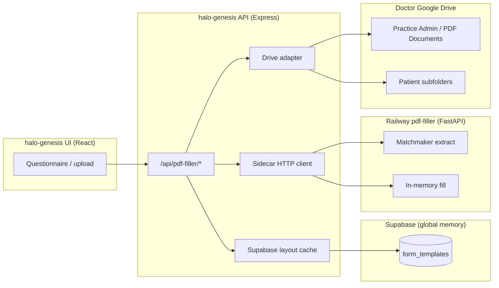
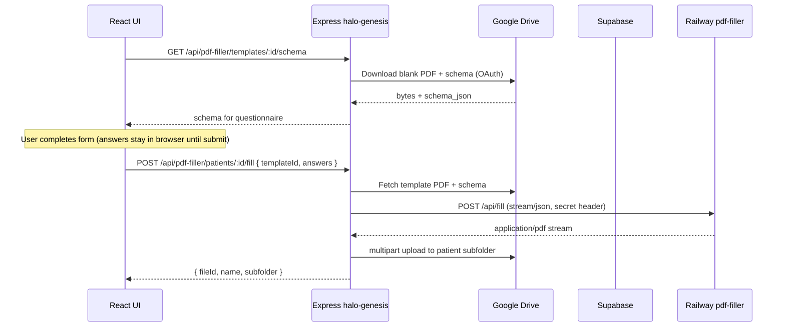

# PDF Filler Integration Blueprint

**Audience:** Engineering (halo-genesis + [pdf-mapper-endpoint](https://github.com/halomedical/pdf-mapper-endpoint))  
**Branch:** `feature/pdf-filler-integration`  
**Stack note:** halo-genesis is **Express 5 + Vite/React** (not Next.js). This document uses Express patterns; API routes live under `/api/*`, not App Router.

---

## Executive summary

| System | Role | Persists PHI? |
|--------|------|----------------|
| **Google Drive** (doctor OAuth) | Source of truth for blank templates, per-practice schemas, filled PDFs, manifests | Yes (doctor-controlled) |
| **Supabase** | Global **layout memory**: `pdf_hash` → perfected `schema_json` (coordinates) | No PHI — structural metadata only |
| **Railway (pdf-filler)** | Ephemeral **Matchmaker + fill** CPU; bytes in, bytes out | No durable PHI — in-memory only |
| **halo-genesis** | Auth, Drive I/O, cache orchestration, UI proxy | Session tokens only; no PDF warehouse |

POPIA posture: patient identifiers and filled documents never land on Railway disks or in Supabase; only anonymous PDF fingerprints and field geometry are shared globally.

---

## 1. Architectural split (who owns what?)

### 1.1 Three-system boundary diagram



### 1.2 Supabase — global layout flywheel

**Purpose:** When any practice uploads the *same* blank PDF (e.g. standard insurer form), we should not re-run expensive Matchmaker extraction. We store the **perfected** `schema_json` (x/y, field types, labels) keyed by a **content hash** of the blank PDF.

**Primary key:** `pdf_hash` (MD5 hex of raw PDF bytes — stable for dedup; consider SHA-256 in a future column if compliance prefers).

**Migration:** `supabase/migrations/20250610120000_form_templates_global_layout.sql`

```sql
-- Core row (no PHI)
pdf_hash       text PRIMARY KEY,  -- md5(pdf_bytes) hex
schema_json    jsonb NOT NULL,      -- perfected layout + x-extraction-method metadata
extraction_method text,
schema_version integer,
hit_count      bigint,              -- flywheel metrics
updated_at     timestamptz
```

**Why this is the flywheel**

1. **Upload path:** Genesis hashes the PDF → `SELECT` Supabase → on **hit**, skip Railway extract and use `schema_json`.
2. **Miss path:** Genesis calls Railway `/api/extract-schema` → human QA or auto-promotion → `UPSERT` into `form_templates`.
3. **Learning:** Manual corrections in Drive (`*.schema.json`) can be **promoted** back to Supabase (hash must match) so all practices benefit.
4. **POPIA:** Rows contain no patient name, ID number, or answers — only layout wisdom tied to a hash of a **blank** form.

**Access:** Backend uses `SUPABASE_URL` + `SUPABASE_SERVICE_ROLE_KEY` only on the server. RLS denies browser direct access (see migration policies).

### 1.3 Railway — stateless Python sidecar (“the brain”)

**Responsibilities**

- `GET /health` — liveness
- `POST /api/extract-schema` — multipart `file` → JSON Schema (Matchmaker)
- `POST /api/fill` — JSON or multipart stream → `application/pdf` bytes

**Non-goals**

- No database, no object store, no writing uploads to `/tmp` beyond process RAM (disable spooling where the library allows).
- No Google OAuth; no Supabase client.
- No public anonymous access — shared secret header (§3).

**Runtime:** Docker on Railway; `PORT` from platform; `GEMINI_API_KEY` for Matchmaker only on this service.

### 1.4 halo-genesis — router, UI, Drive custody

**Responsibilities**

- Google OAuth session (`requireAuth`), token refresh ([`server/middleware/requireAuth.ts`](../server/middleware/requireAuth.ts)).
- Drive paths: `Halo_Patients/Practice Admin/PDF Documents/` ([`shared/folderStructure.ts`](../shared/folderStructure.ts)).
- Per-practice manifest `halo_pdf_templates.json` + `{name}.pdf` + `{name}.schema.json` ([`server/services/pdfTemplatesManifest.ts`](../server/services/pdfTemplatesManifest.ts)).
- Orchestration: hash → Supabase → optional Railway → persist to **doctor’s** Drive.
- Browser talks only to `/api/pdf-filler/*`; never to Railway or Supabase.

**Today vs target**

| Capability | Today (`main`) | Target (`feature/pdf-filler-integration`) |
|------------|----------------|---------------------------------------------|
| Routes | [`server/routes/pdfFiller.ts`](../server/routes/pdfFiller.ts) | Thin routes → `pdfFillerController` |
| Sidecar client | [`server/services/pdfFillerClient.ts`](../server/services/pdfFillerClient.ts) (buffer/base64 fill) | Streaming fill + extract |
| Global cache | None | `server/services/formTemplateCache.ts` → Supabase |
| Secret env | `PDF_FILLER_SERVICE_SECRET` + `X-Pdf-Filler-Secret` | Add alias `PDF_FILLER_SECRET_KEY` (same value) |

---

## 2. Feature branch structure (`feature/pdf-filler-integration`)

### 2.1 Directory layout (additions / moves)

```text
halo-genesis/
├── docs/
│   └── PDF_FILLER_INTEGRATION_BLUEPRINT.md          # this file
├── supabase/migrations/
│   └── 20250610120000_form_templates_global_layout.sql
├── shared/
│   └── pdfFiller.ts                                 # existing types (unchanged contract)
├── server/
│   ├── config/index.ts                              # + SUPABASE_*, PDF_FILLER_SECRET_KEY alias
│   ├── controllers/
│   │   └── pdfFillerController.ts                   # NEW — orchestration only
│   ├── middleware/
│   │   └── requirePdfFillerFeature.ts               # optional: wrap requireFeature('pdfFiller')
│   ├── routes/
│   │   └── pdfFiller.ts                             # slim: wire HTTP → controller
│   ├── services/
│   │   ├── pdfFillerClient.ts                       # streaming sidecar I/O
│   │   ├── formTemplateCache.ts                     # NEW — Supabase get/upsert/bump hit
│   │   ├── pdfHash.ts                               # NEW — md5Hex(buffer)
│   │   └── drive.ts                                 # existing uploads/downloads
│   └── types/
│       └── pdfFiller.ts                             # NEW — request/response DTOs
├── services/pdf-filler-sidecar/                     # deployment artifacts for pdf-filler repo OR mirror
│   ├── Dockerfile
│   ├── railway.toml
│   └── README.md
└── src/shell/src/modules/pdf-filler/                # existing UI; optional stream download UX
```

### 2.2 Environment variables (halo-genesis)

```bash
# --- Sidecar (Railway) ---
PDF_FILLER_SERVICE_URL=https://pdf-filler-production.up.railway.app
# Prefer one name in ops; support both in config:
PDF_FILLER_SECRET_KEY=<openssl rand -hex 32>
PDF_FILLER_SERVICE_SECRET=${PDF_FILLER_SECRET_KEY}   # legacy alias (existing code)

# --- Supabase (server-only) ---
SUPABASE_URL=https://xxxx.supabase.co
SUPABASE_SERVICE_ROLE_KEY=eyJ...   # never expose to Vite/browser

# --- Existing (unchanged) ---
GOOGLE_CLIENT_ID=...
GOOGLE_CLIENT_SECRET=...
SESSION_SECRET=...
GEMINI_API_KEY=...   # monolith AI features; sidecar has its own GEMINI on Railway
```

**Railway (pdf-filler only)**

```bash
GEMINI_API_KEY=...
PDF_FILLER_SECRET_KEY=<same as genesis>
PORT=<injected by Railway>
```

### 2.3 Config extension (TypeScript)

```typescript
// server/config/index.ts (additions)
pdfFillerServiceUrl: (process.env.PDF_FILLER_SERVICE_URL || 'http://localhost:8000').replace(/\/$/, ''),
pdfFillerSecretKey:
  process.env.PDF_FILLER_SECRET_KEY ||
  process.env.PDF_FILLER_SERVICE_SECRET ||
  '',
supabaseUrl: process.env.SUPABASE_URL || '',
supabaseServiceRoleKey: process.env.SUPABASE_SERVICE_ROLE_KEY || '',
```

### 2.4 `pdfHash.ts`

```typescript
import { createHash } from 'crypto';

export function md5HexPdf(buffer: Buffer): string {
  return createHash('md5').update(buffer).digest('hex');
}
```

### 2.5 `formTemplateCache.ts` (Supabase)

```typescript
import { createClient, SupabaseClient } from '@supabase/supabase-js';
import { config } from '../config';

export interface FormTemplateRow {
  pdf_hash: string;
  schema_json: Record<string, unknown>;
  extraction_method: string;
  schema_version: number;
}

let client: SupabaseClient | null = null;

function getClient(): SupabaseClient | null {
  if (!config.supabaseUrl || !config.supabaseServiceRoleKey) return null;
  if (!client) {
    client = createClient(config.supabaseUrl, config.supabaseServiceRoleKey, {
      auth: { persistSession: false, autoRefreshToken: false },
    });
  }
  return client;
}

export async function getGlobalSchemaByHash(pdfHash: string): Promise<FormTemplateRow | null> {
  const sb = getClient();
  if (!sb) return null;
  const { data, error } = await sb
    .from('form_templates')
    .select('pdf_hash, schema_json, extraction_method, schema_version')
    .eq('pdf_hash', pdfHash)
    .maybeSingle();
  if (error) throw new Error(`form_templates read failed: ${error.message}`);
  if (!data) return null;
  await sb.rpc('increment_form_template_hit', { p_pdf_hash: pdfHash }).catch(() => {
    // optional RPC; or fire-and-forget update hit_count in app code
  });
  return data as FormTemplateRow;
}

export async function upsertGlobalSchema(row: FormTemplateRow): Promise<void> {
  const sb = getClient();
  if (!sb) return;
  const { error } = await sb.from('form_templates').upsert({
    pdf_hash: row.pdf_hash,
    schema_json: row.schema_json,
    extraction_method: row.extraction_method,
    schema_version: row.schema_version,
    updated_at: new Date().toISOString(),
  });
  if (error) throw new Error(`form_templates upsert failed: ${error.message}`);
}
```

> **Note:** Add optional RPC `increment_form_template_hit` in a follow-up migration, or bump `hit_count` in application code.

### 2.6 `pdfFillerController.ts` — template upload with cache

```typescript
import { Request, Response } from 'express';
import { randomUUID } from 'crypto';
import {
  getOrCreatePracticeAdminPdfDocumentsFolder,
  uploadToDrive,
  upsertJsonFileInFolder,
} from '../services/drive';
import { extractSchemaFromPdf } from '../services/pdfFillerClient';
import { md5HexPdf } from '../services/pdfHash';
import { getGlobalSchemaByHash, upsertGlobalSchema } from '../services/formTemplateCache';
import { loadPdfTemplatesManifest, savePdfTemplatesManifest, findTemplateEntry } from '../services/pdfTemplatesManifest';
import type { PdfDocumentType, PdfTemplateManifestEntry } from '../../shared/pdfFiller';
import { isPdfDocumentType } from '../../shared/pdfFiller';

export async function uploadTemplate(req: Request, res: Response): Promise<void> {
  const token = req.session.accessToken!;
  const fileName = String(req.body.fileName || '');
  const fileData = req.body.fileData as string;
  const documentTypeRaw = String(req.body.documentType || '');
  const displayNameInput = String(req.body.displayName || '');

  if (!fileName.toLowerCase().endsWith('.pdf')) {
    res.status(400).json({ error: 'A PDF file name is required.' });
    return;
  }
  if (!isPdfDocumentType(documentTypeRaw)) {
    res.status(400).json({ error: 'Invalid document type.' });
    return;
  }
  const pdfBuffer = Buffer.from(fileData, 'base64');
  const pdfHash = md5HexPdf(pdfBuffer);

  let schema: Record<string, unknown>;
  let extractionMethod: string;

  const cached = await getGlobalSchemaByHash(pdfHash);
  if (cached) {
    schema = cached.schema_json;
    extractionMethod = cached.extraction_method || 'global_cache';
  } else {
    schema = await extractSchemaFromPdf(pdfBuffer, fileName);
    extractionMethod = String(schema['x-extraction-method'] || 'matchmaker');
    await upsertGlobalSchema({
      pdf_hash: pdfHash,
      schema_json: schema,
      extraction_method: extractionMethod,
      schema_version: Number(schema['x-schema-build-version'] || 1),
    });
  }

  const documentType = documentTypeRaw as PdfDocumentType;
  const stem = fileName.replace(/\.pdf$/i, '').trim() || 'template';
  const displayName = displayNameInput || stem;
  const folderId = await getOrCreatePracticeAdminPdfDocumentsFolder(token);

  const pdfDriveFileId = await uploadToDrive(token, `${stem}.pdf`, 'application/pdf', folderId, pdfBuffer, {
    halo_pdf_template: '1',
    document_type: documentType,
    pdf_hash: pdfHash,
  });
  const schemaDriveFileId = await upsertJsonFileInFolder(token, folderId, `${stem}.schema.json`, schema, {
    halo_pdf_template_schema: '1',
    document_type: documentType,
    pdf_hash: pdfHash,
  });

  const { manifest } = await loadPdfTemplatesManifest(token, folderId);
  const now = new Date().toISOString();
  const entry: PdfTemplateManifestEntry = {
    templateId: randomUUID(),
    displayName,
    documentType,
    pdfDriveFileId,
    schemaDriveFileId,
    extractionMethod,
    schemaVersion: Number(schema['x-schema-build-version'] || 0),
    createdAt: now,
    updatedAt: now,
  };
  manifest.templates.push(entry);
  await savePdfTemplatesManifest(token, folderId, manifest);

  res.json({ template: entry, pdfHash, cacheHit: Boolean(cached) });
}
```

### 2.7 Slim route wiring

```typescript
// server/routes/pdfFiller.ts
import { Router } from 'express';
import { requireAuth } from '../middleware/requireAuth';
import * as pdfFillerController from '../controllers/pdfFillerController';

const router = Router();
router.use(requireAuth);

router.post('/templates', (req, res) => pdfFillerController.uploadTemplate(req, res));
router.post('/patients/:patientId/fill', (req, res) => pdfFillerController.fillPatientForm(req, res));
// ... keep list/get/delete handlers or move similarly

export default router;
```

### 2.8 Multipart proxy to Python (extract)

Existing client already uses `FormData` + `fetch` ([`server/services/pdfFillerClient.ts`](../server/services/pdfFillerClient.ts)). Production hardening:

```typescript
import { config } from '../config';
import { GEMINI_TIMEOUT_MS } from './gemini';

const SIDECAR_TIMEOUT_MS = GEMINI_TIMEOUT_MS + 30_000;

function sidecarHeaders(extra?: Record<string, string>): HeadersInit {
  const headers: Record<string, string> = { ...extra };
  const secret = config.pdfFillerSecretKey;
  if (secret) {
    headers['X-Pdf-Filler-Secret'] = secret;
    headers['Authorization'] = `Bearer ${secret}`; // FastAPI middleware below accepts either
  }
  return headers;
}

export async function extractSchemaFromPdf(pdfBuffer: Buffer, fileName: string): Promise<Record<string, unknown>> {
  const form = new FormData();
  const blob = new Blob([Uint8Array.from(pdfBuffer)], { type: 'application/pdf' });
  form.append('file', blob, fileName);

  const res = await fetch(`${config.pdfFillerServiceUrl}/api/extract-schema`, {
    method: 'POST',
    headers: sidecarHeaders(),
    body: form,
    signal: AbortSignal.timeout(SIDECAR_TIMEOUT_MS),
  });

  if (!res.ok) {
    const text = await res.text().catch(() => '');
    throw new Error(`PDF filler extract-schema failed (${res.status}): ${text}`);
  }
  return (await res.json()) as Record<string, unknown>;
}
```

---

## 3. Secure hosting on Railway & zero-trust proxy

### 3.1 Docker blueprint (pdf-filler repo)

```dockerfile
# services/pdf-filler-sidecar/Dockerfile (copy to pdf-filler repo root for deploy)
FROM python:3.12-slim

WORKDIR /app
ENV PYTHONDONTWRITEBYTECODE=1 PYTHONUNBUFFERED=1

RUN apt-get update && apt-get install -y --no-install-recommends \
    build-essential \
 && rm -rf /var/lib/apt/lists/*

COPY requirements.txt .
RUN pip install --no-cache-dir -r requirements.txt

COPY . .

# Non-root
RUN useradd -m appuser && chown -R appuser:appuser /app
USER appuser

CMD ["uvicorn", "api:app", "--host", "0.0.0.0", "--port", "${PORT:-8000}"]
```

> Railway injects `PORT`; prefer a small `start.sh` that expands `$PORT` if your base image CMD cannot interpolate env.

```bash
#!/bin/sh
exec uvicorn api:app --host 0.0.0.0 --port "${PORT:-8000}"
```

### 3.2 `railway.toml`

```toml
[build]
builder = "DOCKERFILE"
dockerfilePath = "Dockerfile"

[deploy]
healthcheckPath = "/health"
healthcheckTimeout = 120
restartPolicyType = "ON_FAILURE"
```

### 3.3 FastAPI — secret middleware (Python)

```python
# api.py (pdf-filler repo) — connection point
import os
from fastapi import FastAPI, Request, HTTPException
from starlette.middleware.base import BaseHTTPMiddleware

EXPECTED_SECRET = os.environ.get("PDF_FILLER_SECRET_KEY", "")

class SidecarAuthMiddleware(BaseHTTPMiddleware):
    async def dispatch(self, request: Request, call_next):
        if request.url.path == "/health":
            return await call_next(request)
        if not EXPECTED_SECRET:
            raise HTTPException(status_code=500, detail="Sidecar misconfigured")
        token = request.headers.get("X-Pdf-Filler-Secret") or ""
        auth = request.headers.get("Authorization", "")
        if auth.startswith("Bearer "):
            token = token or auth.removeprefix("Bearer ").strip()
        if token != EXPECTED_SECRET:
            raise HTTPException(status_code=401, detail="Unauthorized")
        return await call_next(request)

app = FastAPI()
app.add_middleware(SidecarAuthMiddleware)

@app.get("/health")
async def health():
    return {"status": "ok"}
```

### 3.4 Express — outbound only (no inbound sidecar auth)

Genesis does **not** expose Railway to the browser. Inbound protection is session auth on `/api/pdf-filler`. Outbound:

```typescript
// server/middleware/ensureSidecarConfigured.ts
import { config } from '../config';

export function ensureSidecarConfigured(): void {
  if (!config.pdfFillerServiceUrl) {
    throw new Error('PDF_FILLER_SERVICE_URL is not set');
  }
  if (config.isProduction && !config.pdfFillerSecretKey) {
    throw new Error('PDF_FILLER_SECRET_KEY is required in production');
  }
}
```

Call `ensureSidecarConfigured()` at module load in `pdfFillerClient.ts` when `NODE_ENV=production`.

### 3.5 Railway deployment checklist

1. New project → deploy **pdf-filler** GitHub repo (branch `feature/pdf-filler-integration` or release tag).
2. Set variables: `GEMINI_API_KEY`, `PDF_FILLER_SECRET_KEY` (match genesis).
3. Public domain → copy URL to genesis `PDF_FILLER_SERVICE_URL`.
4. Do **not** set Supabase or Google credentials on Railway.
5. Verify: `curl -s https://…/health` → 200; `POST /api/extract-schema` without header → 401.

---

## 4. Decentralized Google Drive workflow (filled PDF)

### 4.1 Sequence (end-to-end)



**Important:** Current UI sends **only** `templateId` + `answers`; genesis loads the blank PDF from Drive server-side ([`fillPatientPdfForm`](../src/shell/src/services/api.ts)). That keeps blank templates off the client wire on fill and is POPIA-friendly. Optional future: client sends bytes only when offline template cache exists.

### 4.2 Streaming fill controller (production-oriented)

Avoid holding full PDF in multiple buffers where possible: stream Railway response → temp pipeline → Drive multipart upload.

```typescript
import { Request, Response } from 'express';
import { Readable } from 'stream';
import { pipeline } from 'stream/promises';
import { config } from '../config';
import {
  downloadFileBuffer,
  getOrCreatePatientSubfolder,
  getOrCreatePracticeAdminPdfDocumentsFolder,
  uploadToDrive,
} from '../services/drive';
import { findTemplateEntry, loadPdfTemplatesManifest } from '../services/pdfTemplatesManifest';
import { PDF_DOCUMENT_TYPE_TO_PATIENT_SUBFOLDER } from '../../shared/pdfFiller';
import { sanitizeString } from '../services/drive';

const FILL_TIMEOUT_MS = 120_000;

function sidecarHeadersJson(): Record<string, string> {
  const h: Record<string, string> = { 'Content-Type': 'application/json' };
  const secret = config.pdfFillerSecretKey;
  if (secret) {
    h['X-Pdf-Filler-Secret'] = secret;
    h['Authorization'] = `Bearer ${secret}`;
  }
  return h;
}

/** Collect stream to Buffer when Drive API requires buffer (current uploadToDrive). */
async function bufferFromWebStream(body: ReadableStream<Uint8Array>): Promise<Buffer> {
  const reader = body.getReader();
  const chunks: Buffer[] = [];
  let total = 0;
  const MAX = 25 * 1024 * 1024;
  while (true) {
    const { done, value } = await reader.read();
    if (done) break;
    total += value.byteLength;
    if (total > MAX) throw new Error('Filled PDF exceeds size limit');
    chunks.push(Buffer.from(value));
  }
  return Buffer.concat(chunks);
}

export async function fillPatientForm(req: Request, res: Response): Promise<void> {
  const token = req.session.accessToken!;
  const patientFolderId = String(req.params.patientId);
  const templateId = sanitizeString(req.body.templateId, 64);
  const answers = req.body.answers as Record<string, unknown> | undefined;

  if (!templateId || !answers || typeof answers !== 'object') {
    res.status(400).json({ error: 'templateId and answers are required.' });
    return;
  }

  const folderId = await getOrCreatePracticeAdminPdfDocumentsFolder(token);
  const { manifest } = await loadPdfTemplatesManifest(token, folderId);
  const entry = findTemplateEntry(manifest, templateId);
  if (!entry) {
    res.status(404).json({ error: 'Template not found.' });
    return;
  }

  const [pdfBuffer, schemaBuffer] = await Promise.all([
    downloadFileBuffer(token, entry.pdfDriveFileId),
    downloadFileBuffer(token, entry.schemaDriveFileId),
  ]);
  const schema = JSON.parse(schemaBuffer.toString('utf-8')) as Record<string, unknown>;

  const sidecarRes = await fetch(`${config.pdfFillerServiceUrl}/api/fill`, {
    method: 'POST',
    headers: sidecarHeadersJson(),
    body: JSON.stringify({
      pdf_base64: pdfBuffer.toString('base64'),
      schema,
      answers,
    }),
    signal: AbortSignal.timeout(FILL_TIMEOUT_MS),
  });

  if (!sidecarRes.ok || !sidecarRes.body) {
    const detail = await sidecarRes.text().catch(() => '');
    res.status(502).json({ error: 'PDF fill service failed.', detail });
    return;
  }

  const filledPdf = await bufferFromWebStream(sidecarRes.body);

  const subfolderName = PDF_DOCUMENT_TYPE_TO_PATIENT_SUBFOLDER[entry.documentType];
  const targetFolderId = await getOrCreatePatientSubfolder(token, patientFolderId, subfolderName);
  const outName = `${entry.displayName} — filled ${new Date().toISOString().slice(0, 10)}.pdf`;

  const fileId = await uploadToDrive(token, outName, 'application/pdf', targetFolderId, filledPdf, {
    halo_pdf_filled: '1',
    template_id: templateId,
  });

  res.json({ fileId, name: outName, subfolder: subfolderName, templateId });
}
```

**Phase 2 (true streaming):** Change pdf-filler to accept `multipart/form-data` (`file`, `schema`, `answers`) and return raw PDF stream; pipe `sidecarRes.body` through `Readable.fromWeb` into a Drive **resumable upload** session so genesis never holds the full file. Google Drive resumable API is the right integration point.

```typescript
// Phase 2 sketch — pipe without full buffer
import { Readable } from 'node:stream';

const nodeStream = Readable.fromWeb(sidecarRes.body as import('stream/web').ReadableStream);
await uploadStreamToDriveResumable(token, outName, targetFolderId, nodeStream, 'application/pdf');
```

### 4.3 FastAPI fill endpoint (mock connection point)

```python
from fastapi import FastAPI, File, UploadFile, Form
from fastapi.responses import StreamingResponse
import json
import io

@app.post("/api/fill")
async def fill_pdf(
    file: UploadFile = File(...),
    schema: str = Form(...),
    answers: str = Form(...),
):
    pdf_bytes = await file.read()  # in-memory only
    schema_obj = json.loads(schema)
    answers_obj = json.loads(answers)
    filled = fill_pdf_in_memory(pdf_bytes, schema_obj, answers_obj)  # your pipeline
    return StreamingResponse(io.BytesIO(filled), media_type="application/pdf")
```

JSON/base64 fill (compatible with current genesis client) remains supported in parallel during migration.

### 4.4 Subfolder routing (unchanged)

| Document type | Patient subfolder |
|---------------|-------------------|
| insurance_form | Scanned Documents |
| consent | Letters |
| referral | Subspecialist Referral |
| clinical_form | Clerking Sheets |
| other | Scanned Documents |

---

## 5. Branch workflow & PR slicing

Suggested commits on `feature/pdf-filler-integration`:

1. **Docs + Supabase migration** — no runtime change.
2. **`formTemplateCache` + hash** — feature-flagged; cache miss → existing behavior.
3. **Controller refactor** — routes thin; parity tests with current API.
4. **Secret header** — genesis + pdf-filler deployed together.
5. **Streaming fill phase 2** — optional follow-up PR.

**CI:** Existing `npm run build` + `test:calendar`; add `server/tests/pdfFiller-hash-cache.test.ts` with mocked Supabase.

**Feature flag:** `pdfFiller` in settings + `pdf-filler-v1` in [`registry/extensions.json`](../registry/extensions.json).

---

## 6. Verification matrix

| Test | Expected |
|------|----------|
| `GET /api/pdf-filler/health` | 200 when Railway `/health` OK |
| Upload same PDF twice | Second upload `cacheHit: true`, no sidecar extract |
| Fill without auth cookie | 401 |
| Sidecar call without secret | 401 from FastAPI |
| Filled file in Drive | Under correct patient subfolder; properties `halo_pdf_filled=1` |
| Supabase row | Contains `pdf_hash` + `schema_json` only — no patient fields |

---

## 7. Related files (current baseline)

- Routes: [`server/routes/pdfFiller.ts`](../server/routes/pdfFiller.ts)
- Sidecar client: [`server/services/pdfFillerClient.ts`](../server/services/pdfFillerClient.ts)
- Deployment overview: [`DEPLOYMENT.md`](../DEPLOYMENT.md) § PDF Filler sidecar
- Sidecar pointer: [`services/pdf-filler-sidecar/README.md`](../services/pdf-filler-sidecar/README.md)

---

*Document owner: Platform / halo-genesis. Update when pdf-filler API version or Supabase RLS model changes.*
